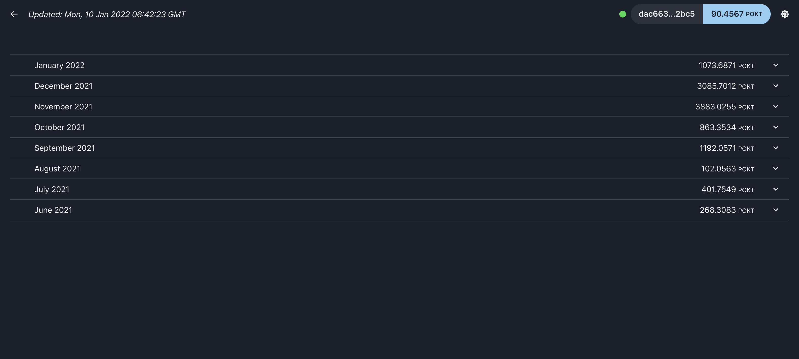

# POKT Tools

A reward explorer and diagnostic tool for Pocket Network nodes.



### Quick start

Steps to run pokt-calculator:  

1) check out the repository:

```shell
git clone https://github.com/itsnoproblem/pokt-calculator
```

2) There are 2 environment variables to pay attention to in the [docker-compose.yml](docker-compose.yml) file:
   - `POCKET_URL` - this is the RPC endpoint the monitoring-service will use to query the Pocket Network.
   - `RPC_URL` - This url needs to be accesible by your browser. Most people will want to update the docker-compose file, 
     replacing *http://YOUR-PUBLIC-IP-OR-HOSTNAME:7878* with *http://your.hostname.com:7878*
   

3) Start the containers:
```shell
docker-compose up -d
```

Now you can visit the app im your browser at http://your.hostname.com:4444

Happy exploring!

> **Note:** It is recommended that you replace the value of the `POCKET_URL`.  This could be your node's service url
> (Eg: `https://your-service-url.com:443/v1`) or another Pocket Network RPC URL.  This repo ships with a functioning, 
> free-tier Pocket endpoint, but performance will be limited.
> 
> You can get your own pocket network endpoint by visiting https://www.portal.pokt.network
> and creating an app on the Pocket Mainnet. 

# Support this project

Several people have requested a POKT address they can send donations to, in order to support this project. 

If you find this tool usefule and would like to buy me a coffee, or a beer, or a taco, feel free to send POKT to `4fdb144edcfd0d44be506face06be7bddc680fe8`
